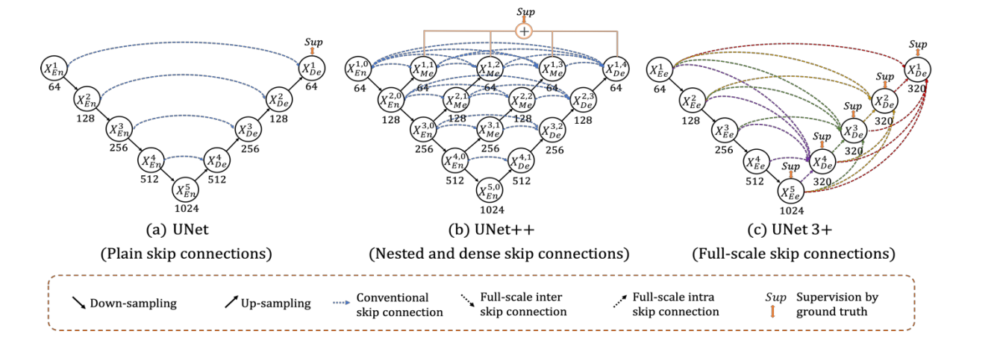
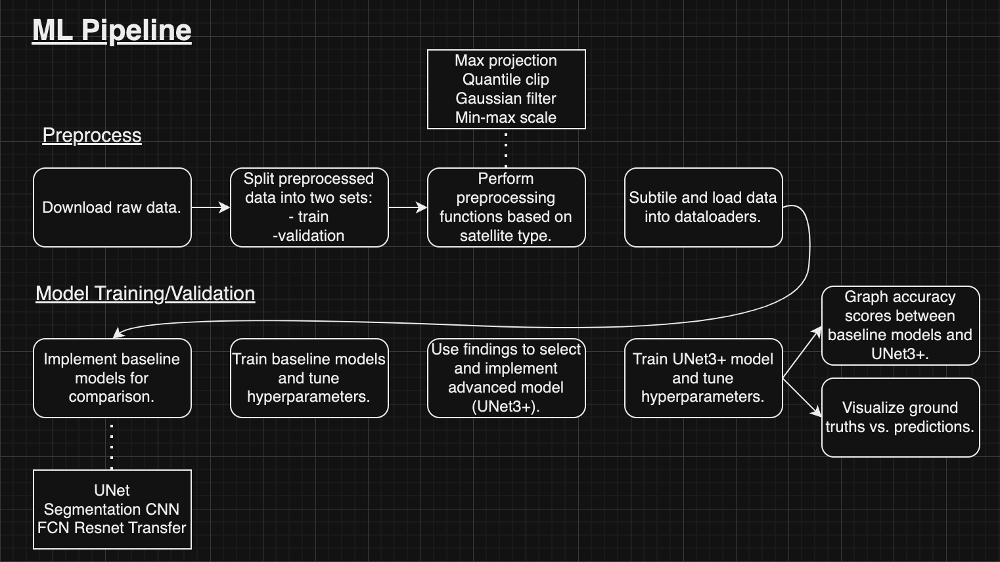
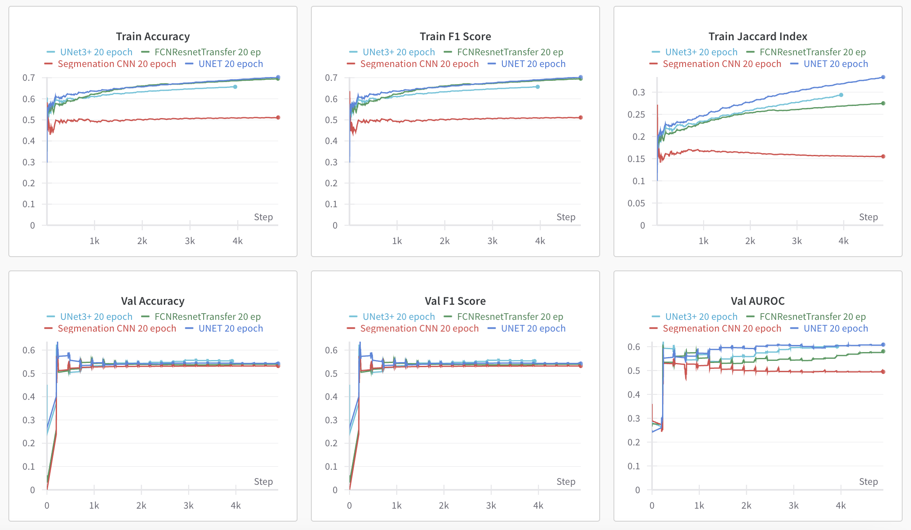
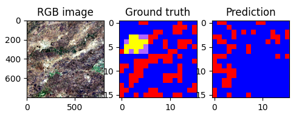
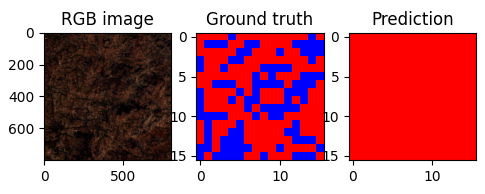
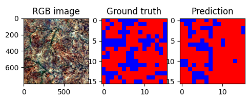
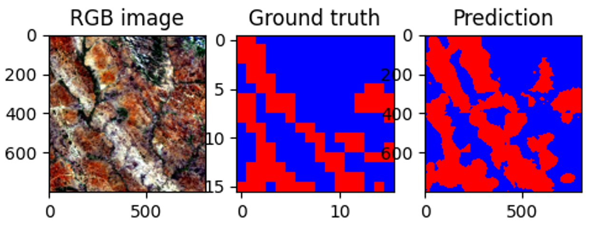

[](https://classroom.github.com/a/6ndC2138)

# Final Project: AI for Social Good - Energy and Settlement Detection

### Team Do Social Good

- **Loi Nguyen**
- **Kai Yu**
- **Ky-Anh Ho**
- **Yunzhe Li**



Fig 1: Comparison of UNet (a), UNet++(b) and proposed UNet 3+ (c). The depth of each node is presented below the circle

## UNet3+

U-Net3+ is a variant of the U-Net architecture designed for semantic segmentation tasks. Like the U-Net architecture, it employs an encoder/decoder structure but also introduces full-scale skip connections that aggregates feature maps from different levels of the encoder and decoder. U-Net3+ also employs deep supervision at multiple levels of the encoder which helps with the vanishing gradient problem. In addition to accuracy improvements, UNet3+ reduces network parameters and improves computation efficiency. The original code is available at: [github.com/ZJUGiveLab/UNet-Version](github.com/ZJUGiveLab/UNet-Version)

## Installation

The code requires `python>=3.8`. Required dependencies are found in `requirements.txt`.

Clone the repository locally using

```
git clone https://github.com/cs175cv-s2024/final-project-do-social-good.git
```

Create a virtual environment for dependencies (optional) then install dependencies using

```
pip install -r requirements.txt
```

## Getting Started

Model checkpoints can be downloaded at: [https://drive.google.com/drive/folders/1JmsNXJ9Hsimfr2JaOQ9sa2yyxFtptSyK?usp=sharing](https://drive.google.com/drive/folders/1JmsNXJ9Hsimfr2JaOQ9sa2yyxFtptSyK?usp=sharing)

The following model checkpoints are available:

- UNet
- SegmentationCNN
- FCNResnetTransfer
- UNet_3Plus

Additional checkpoints can be acquired running `train.py` or `train_sweeps.py`. These additional checkpoints can be found in the same directories. An optional data visualization and tracker using WandB can be used by login into an existing WandB account or making a new one here: [https://wandb.ai/site](https://wandb.ai/site)

## ML Pipeline



## Performance

The following shows various aspects for each model.

Fig 2: Comparison of UNet, SegmentationCNN, FCNResnetTransfer, and UNet_3Plus accross various metrics.

Although different parameters were used, most of the models actually performed relatively the same when scored, with some models just slightly outperforming the others. The UNet_3Plus model performed slightly better than the rest in terms of validation score.

Here are some example ground truths vs. predictions for each model.



Fig 3: UNet ground truth vs. prediction example.



Fig 4: SegmentationCNN ground truth vs. prediction example.



Fig 5: FCNResnetTransfer ground truth vs. prediction example.



Fig 6: UNet_3Plus ground truth vs. prediction example.

SegmentationCNN performed the worst and often predicted tiles with only classification 1, the most common class. FCNResnet Transfer and UNet were both able to get more accurate predictions in comparison to the ground truths. UNet_3Plus, with a prediction of size 400x400 rather than the usual 8x8, seems to predict most accurately was able to correctly predict the less common classes 3 and 4.

## Dataset

The data used comes from the IEEE GRSS 2021 ESD dataset. The dataset is composed of 98 tiles of 800x800 pixels representing a 64 km² area each, in which we use the training set of 60 tiles to train our model with. Each file in a tile folder is typically a .tif, such as `S1A*IW_GRDH*\*.tif`, which represent the Sentinel-1 and 2, VIIRS, and Landsat-8 satellites, as well as a ground truth file to compare with later on. Within each satellite, the attributes we investigated were related to the dates and bands, which helped us in our goal of determining settlements with and without electricity.

More information can be found at:
[https://www.grss-ieee.org/community/technical-committees/2021-ieee-grss-data-fusion-contest-track-dse/](https://www.grss-ieee.org/community/technical-committees/2021-ieee-grss-data-fusion-contest-track-dse/)

## Additional Resources

* [Project Poster](https://docs.google.com/presentation/d/1mUELAEvSfLKri0StTymHXN8lPrA660Y1IoNSSWaoG8A/edit#slide=id.p1)
* [Technical Memorandum](https://docs.google.com/document/d/1YPw295mx0uOh3ytF32s8Eda0QMACDANi3zZajqkPD_Y/edit#heading=h.pwg22b1zfd68)
* [Project Slides](https://docs.google.com/presentation/d/15fnRyB-LHrglibXVFjYOxkanByDxInItlyZMOs1ytlk/edit#slide=id.g273633b852b_0_93)
* [Presentation Video](https://drive.google.com/file/d/1owftS_8gut7fpxx7PQ5mKePJ7w4W1_r7/view?usp=sharing)
## Acknowledgements

This project makes use of the base Unet3+ implementation described in the following paper:
[UNet 3+: A Full-Scale Connected UNet for Medical Image Segmentation](https://arxiv.org/abs/2004.08790)

Basic `README.md` layout inspiration was taken from the SegmentAnything Model (SAM):
[https://github.com/facebookresearch/segment-anything](https://github.com/facebookresearch/segment-anything)

Furthermore, we would like to give acknowledgements to CS 175 Spring Quarter course staff for help and guidance.

## Citation

- Nguyen, L., Yu, K., Ho, K., Li, Y., 2024: final-project-do-social-good. GitHub repository, accessed 12 June 2024,

```
@misc{final-project-do-social-good,
  author = {Nguyen, Loi and Yu, Kai and Ho, Ky-anh and Li, Yunzhe},
  title = {final-project-do-social-good},
  year = {2024},
  publisher = {GitHub},
  journal = {GitHub repository},
  howpublished = {\url{https://github.com/cs175cv-s2024/final-project-do-social-good}},
}
```
